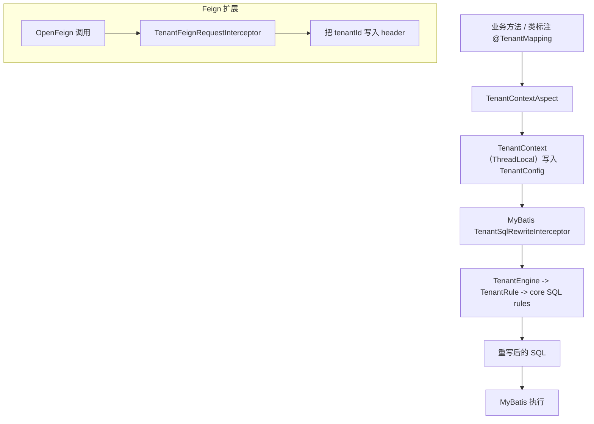

# sql-rewriter

一个可扩展的 SQL 重写引擎 + Spring/MyBatis 租户（多租户）接入 Starter，核心基于 JSqlParser 的 AST 改写，而非字符串拼接。

## 模块说明

- `sql-rewriter-core`：SQL 重写引擎与规则/表达式体系
- `sql-rewriter-plugin-tenant`：MyBatis 租户重写插件（拦截器 + 租户引擎）
- `sql-rewriter-starter-tenant`：注解驱动的租户 SQL 重写（MyBatis + Spring AOP）
- `sql-rewriter-starter-tenant-feign`：在租户能力基础上，结合 Spring MVC（读请求头）和 OpenFeign（透传租户头）
- `sql-rewriter-bom`：给外部消费者用的 Maven BOM（统一版本管理）

## 快速入口

- 先看 `sql-rewriter-starter-tenant`：[
  `sql-rewriter-starter/sql-rewriter-starter-tenant/README.md`](./sql-rewriter-starter/sql-rewriter-starter-tenant/README.md)
- 再看 Feign 透传：[
  `sql-rewriter-starter/sql-rewriter-starter-tenant-feign/README.md`](./sql-rewriter-starter/sql-rewriter-starter-tenant-feign/README.md)
- 想了解底层机制（ThreadLocal + MyBatis 拦截器）看：[
  `sql-rewriter-plugin/sql-rewriter-plugin-tenant/README.md`](./sql-rewriter-plugin/sql-rewriter-plugin-tenant/README.md)

## 整体架构图（从注解到 SQL）

## 模块联动建议阅读顺序

1. `sql-rewriter-core`（理解“规则怎么改 SQL”）：[`sql-rewriter-core/README.md`](./sql-rewriter-core/README.md)
2. `sql-rewriter-plugin-tenant`（理解“租户怎么进 MyBatis”）：[
   `sql-rewriter-plugin/sql-rewriter-plugin-tenant/README.md`](./sql-rewriter-plugin/sql-rewriter-plugin-tenant/README.md)
3. `sql-rewriter-starter-tenant`（用注解一键接入）：[
   `sql-rewriter-starter/sql-rewriter-starter-tenant/README.md`](./sql-rewriter-starter/sql-rewriter-starter-tenant/README.md)
4. `sql-rewriter-starter-tenant-feign`（接入 Feign 透传）：[
   `sql-rewriter-starter/sql-rewriter-starter-tenant-feign/README.md`](./sql-rewriter-starter/sql-rewriter-starter-tenant-feign/README.md)
