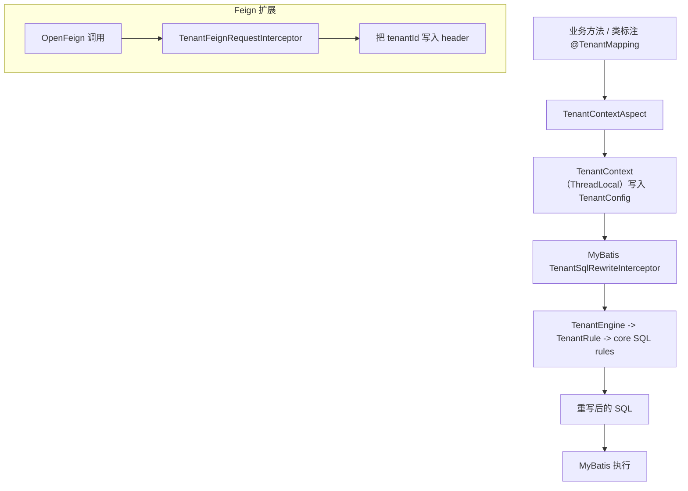

# SQL Rewriter（租户多租户 Starter / Plugin / Core）

基于 JSqlParser 的 SQL AST 改写引擎，提供 Spring/MyBatis 场景下的“注解驱动租户隔离”，并可选 OpenFeign 透传 `tenantId`。

## 核心价值

- **AST 改写而非字符串拼接**：更稳定、更可控的 SQL 修改能力
- **注解驱动、面向业务**：用 `@TenantMapping` 声明“租户 ID + 表字段映射”，自动写入 `TenantContext`
- **MyBatis 拦截器落地**：在执行 SQL 前读取租户配置并重写 SQL
- **Feign 透传一体化**：`@EnableTenantSqlRewriterFeign` 自动把当前 `tenantId` 写入下游请求 header
- **安全降级**：当 `tenantId` 无法解析（为 `null`）时，框架会直接跳过 SQL 重写（不污染链路）

## 模块说明

- `sql-rewriter-core`：SQL 重写引擎与规则/表达式体系
- `sql-rewriter-plugin-tenant`：MyBatis 租户重写插件（拦截器 + 租户引擎）
- `sql-rewriter-starter-tenant`：注解驱动的租户 SQL 重写（MyBatis + Spring AOP）
- `sql-rewriter-starter-tenant-feign`：在租户能力基础上接入 Spring MVC + OpenFeign
- `sql-rewriter-bom`：对外提供统一版本管理（Maven BOM）

## 一键快速开始（Tenant Starter）

### 1）引入依赖

在业务工程中加入：

```xml
<dependency>
  <groupId>io.github.anthem37</groupId>
  <artifactId>sql-rewriter-starter-tenant</artifactId>
  <version><!-- 你的版本 --></version>
</dependency>
```

（如果你需要 Feign 透传，再额外引入：`sql-rewriter-starter-tenant-feign`）

### 2）启用租户能力

```java
@Configuration
@EnableTenantSqlRewriter
public class TenantRewriterEnableConfig {}
```

### 3）提供 `TenantIdProvider`

```java
@Component
public class HeaderTenantIdProvider implements TenantIdProvider {
    @Override
    public Object getTenantId() {
        // 从请求头/上下文中解析 tenantId
        return "TENANT_001";
    }
}
```

### 4）在方法/类上声明 `@TenantMapping`

```java
@Service
public class OrderService {

    @TenantMapping(
            tenantId = @TenantId(tenantIdProvider = HeaderTenantIdProvider.class),
            tenantTargets = @TenantTargets({
                    @TenantTarget(tableNames = {"orders"}, columnName = "tenant_id"),
                    @TenantTarget(tableNames = {"users"}, columnName = "tenant_code", priority = 5)
            })
    )
    public void listOrders() {
        // 运行时解析 tenantId，自动重写 SQL（MyBatis）
    }
}
```

## （可选）Feign 透传

```java
@Configuration
@EnableTenantSqlRewriterFeign
public class TenantFeignEnableConfig {}
```

此时调用下游 Feign 时，会把当前 `tenantId` 写入 header（默认 key 为 `tenantId`，也可配置）。

## 整体架构图（从注解到 SQL）



## 关键行为（建议重点阅读）

- **`tenantId == null` 跳过 SQL 重写**：本次调用期间不写入 `TenantContext`，也不会触发 MyBatis 重写
- **嵌套调用安全**：跳过重写时会临时清空并在返回后恢复外层 `TenantContext`

## 联动阅读顺序（从“为什么”到“怎么实现”）

1. `sql-rewriter-starter-tenant`：[
   `sql-rewriter-starter/sql-rewriter-starter-tenant/README.md`](./sql-rewriter-starter/sql-rewriter-starter-tenant/README.md)
2. `sql-rewriter-starter-tenant-feign`（可选）：[
   `sql-rewriter-starter/sql-rewriter-starter-tenant-feign/README.md`](./sql-rewriter-starter/sql-rewriter-starter-tenant-feign/README.md)
3. `sql-rewriter-plugin-tenant`：[
   `sql-rewriter-plugin/sql-rewriter-plugin-tenant/README.md`](./sql-rewriter-plugin/sql-rewriter-plugin-tenant/README.md)
4. `sql-rewriter-core`：[`sql-rewriter-core/README.md`](./sql-rewriter-core/README.md)

