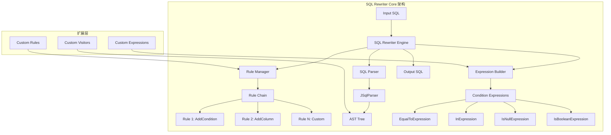
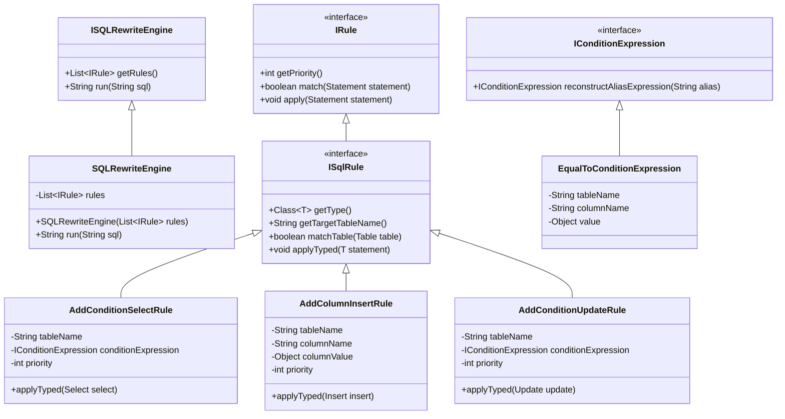
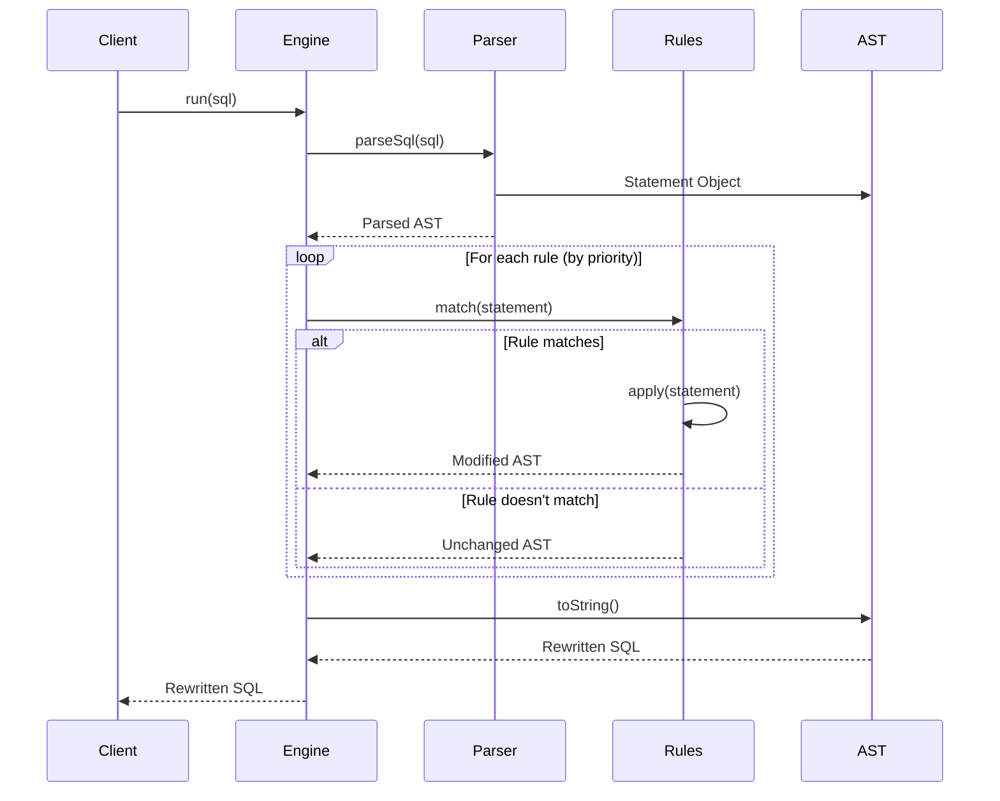
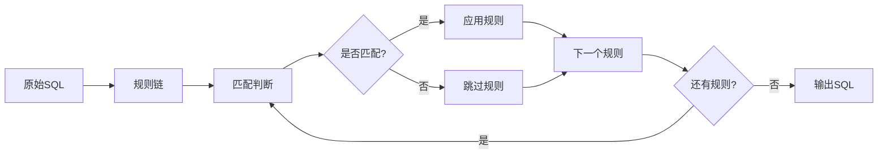

# SQL Rewriter Core

[](https://search.maven.org/artifact/io.github.anthem37/sql-rewriter-core)
[](https://www.oracle.com/java/)
[](LICENSE)

一个强大且灵活的 SQL 重写引擎，基于 JSqlParser 实现，支持动态添加 WHERE 条件、INSERT 列等 SQL 改写操作。

## 🎯 核心特性

- **🔧 灵活规则引擎**：基于规则的 SQL 重写架构，支持自定义规则
- **🎭 类型安全**：强类型设计，支持泛型约束
- **⚡ 高性能**：基于 JSqlParser 的 AST 操作，避免字符串拼接
- **🎪 优先级控制**：支持多规则协同，通过优先级控制执行顺序
- **🔍 表名匹配**：支持精确表名匹配和别名自动适配
- **🌐 跨数据库**：兼容 MySQL、PostgreSQL、Oracle 等主流数据库
- **📝 完整测试**：全面的单元测试覆盖，确保代码质量

## 📋 目录

- [快速开始](#-快速开始)
- [架构设计](#-架构设计)
- [核心组件](#-核心组件)
- [使用指南](#-使用指南)
- [应用场景](#-应用场景)
- [最佳实践](#-最佳实践)
- [性能优化](#-性能优化)
- [扩展开发](#-扩展开发)

## 🚀 快速开始

### Maven 依赖

```xml

<dependency>
    <groupId>io.github.anthem37</groupId>
    <artifactId>sql-rewriter-core</artifactId>
    <version>1.0-SNAPSHOT</version>
</dependency>
```

### 基础示例

```java
import io.github.anthem37.sql.rewriter.core.engine.impl.SQLRewriteEngine;
import io.github.anthem37.sql.rewriter.core.extension.rule.AddConditionSelectRule;
import io.github.anthem37.sql.rewriter.core.extension.expression.impl.EqualToConditionExpression;

// 1. 创建重写规则
AddConditionSelectRule tenantRule = new AddConditionSelectRule(
        "tenant",
        new EqualToConditionExpression("tenant", "tenant_id", "TENANT_001")
);

        // 2. 构建重写引擎
        SQLRewriteEngine engine = new SQLRewriteEngine(java.util.Collections.singletonList(tenantRule));

        // 3. 执行 SQL 重写
        String originalSql = "SELECT * FROM tenant WHERE status = 'ACTIVE'";
        String rewrittenSql = engine.run(originalSql);

        System.out.println(rewrittenSql);
// 输出: SELECT * FROM tenant WHERE status = 'ACTIVE' AND tenant.tenant_id = 'TENANT_001'
```

## 🏗️ 架构设计

### 整体架构图



### 核心类图



### 执行流程图



## 🧩 核心组件

### 1. 重写引擎 (SQLRewriteEngine)

核心执行引擎，负责协调规则的执行和 SQL 的重写：

```java
// 创建引擎
List<IRule> rules = Arrays.asList(
                new AddConditionSelectRule("users", new EqualToConditionExpression("users", "tenant_id", "TENANT_001")),
                new AddColumnInsertRule("users", "created_by", "system")
        );
SQLRewriteEngine engine = new SQLRewriteEngine(rules);

// 执行重写
String result = engine.run("SELECT * FROM users WHERE active = 1");
```

### 2. 规则体系 (IRule & ISqlRule)

#### 规则优先级

```java
public final class RulePriority {
    public static final int HIGHEST = 1;      // 系统级规则
    public static final int HIGH = 5;         // 安全相关规则
    public static final int MEDIUM = 10;      // 业务逻辑规则
    public static final int LOW = 20;         // 数据转换规则
    public static final int LOWEST = 50;      // 日志记录规则

    // SQL 类型默认优先级
    public static final int SELECT_DEFAULT = 10;
    public static final int INSERT_DEFAULT = 20;
    public static final int UPDATE_DEFAULT = 30;
    public static final int DELETE_DEFAULT = 40;
}
```

#### 自定义规则示例

```java
public class CustomSelectRule implements ISqlRule<Select> {
    private final String tableName;
    private final IConditionExpression expression;

    @Override
    public Class<Select> getType() {
        return Select.class;
    }

    @Override
    public String getTargetTableName() {
        return tableName;
    }

    @Override
    public void applyTyped(Select select) {
        // 自定义重写逻辑
        select.accept(new CustomSelectVisitor(tableName, expression));
    }
}
```

### 3. 条件表达式 (IConditionExpression)

#### 支持的表达式类型

| 表达式类型                          | 用途      | 示例                     |
|--------------------------------|---------|------------------------|
| `EqualToConditionExpression`   | 等值比较    | `column = 'value'`     |
| `InConditionExpression`        | IN 条件   | `column IN ('a', 'b')` |
| `IsNullConditionExpression`    | NULL 判断 | `column IS NULL`       |
| `IsBooleanConditionExpression` | 布尔判断    | `column IS TRUE`       |

#### 表达式使用示例

```java
// 等值表达式
EqualToConditionExpression equalExpr = new EqualToConditionExpression(
                "users", "status", "ACTIVE"
        );
// 生成: users.status = 'ACTIVE'

// IN 表达式
InConditionExpression inExpr = new InConditionExpression(
        "users", "role", Arrays.asList("ADMIN", "MANAGER")
);
// 生成: users.role IN ('ADMIN', 'MANAGER')

// 布尔表达式（推荐）
IsBooleanConditionExpression boolExpr = new IsBooleanConditionExpression(
        "users", "active", false, true
);
// 生成: users.active IS TRUE
```

## 📖 使用指南

### 1. 基础使用：多租户数据隔离

```java
public class MultiTenantExample {
    public static void main(String[] args) {
        String tenantId = "tenant_123";

        // 创建租户隔离规则
        List<IRule> rules = Arrays.asList(
                // SELECT 语句租户过滤
                new AddConditionSelectRule(
                        "orders",
                        new EqualToConditionExpression("orders", "tenant_id", tenantId)
                ),
                // INSERT 语句自动添加租户ID
                new AddColumnInsertRule("orders", "tenant_id", tenantId),
                // UPDATE 语句租户过滤
                new AddConditionUpdateRule(
                        "orders",
                        new EqualToConditionExpression("orders", "tenant_id", tenantId)
                ),
                // 用户表租户过滤
                new AddConditionSelectRule(
                        "users",
                        new EqualToConditionExpression("users", "tenant_id", tenantId)
                )
        );

        SQLRewriteEngine engine = new SQLRewriteEngine(rules);

        // 测试查询重写
        String selectSql = "SELECT id, amount FROM orders WHERE status = 'PAID'";
        String rewrittenSelect = engine.run(selectSql);
        System.out.println(rewrittenSelect);
        // 输出: SELECT id, amount FROM orders WHERE status = 'PAID' AND orders.tenant_id = 'tenant_123'

        // 测试插入重写
        String insertSql = "INSERT INTO orders (user_id, amount) VALUES (1, 100.00)";
        String rewrittenInsert = engine.run(insertSql);
        System.out.println(rewrittenInsert);
        // 输出: INSERT INTO orders (user_id, amount, tenant_id) VALUES (1, 100.00, 'tenant_123')

        // 测试更新重写
        String updateSql = "UPDATE orders SET status = 'COMPLETED' WHERE id = 1";
        String rewrittenUpdate = engine.run(updateSql);
        System.out.println(rewrittenUpdate);
        // 输出: UPDATE orders SET status = 'COMPLETED' WHERE (id = 1) AND orders.tenant_id = 'tenant_123'
    }
}
```

### 2. 高级使用：数据权限控制

```java
public class DataPermissionExample {
    public static void main(String[] args) {
        String userId = "user_456";
        List<String> departmentIds = Arrays.asList("dept_1", "dept_2", "dept_3");

        List<IRule> rules = Arrays.asList(
                // 部门数据权限
                new AddConditionSelectRule(
                        "documents",
                        new InConditionExpression("documents", "dept_id", departmentIds)
                ),
                // 个人数据权限（优先级更高）
                new AddConditionSelectRule(
                        "personal_data",
                        new EqualToConditionExpression("personal_data", "owner_id", userId),
                        RulePriority.HIGH // 高优先级
                ),
                // 软删除过滤（最低优先级）
                new AddConditionSelectRule(
                        "orders",
                        new IsNullConditionExpression("orders", "deleted_at"),
                        RulePriority.LOWEST
                )
        );

        SQLRewriteEngine engine = new SQLRewriteEngine(rules);

        String complexSql = "SELECT * FROM documents d " +
                "LEFT JOIN personal_data p ON d.user_id = p.id " +
                "WHERE d.category = 'IMPORTANT'";

        String result = engine.run(complexSql);
        System.out.println(result);
        // 输出: SELECT * FROM documents d 
        //       LEFT JOIN personal_data p ON d.user_id = p.id 
        //       WHERE d.category = 'IMPORTANT' 
        //       AND d.dept_id IN ('dept_1', 'dept_2', 'dept_3') 
        //       AND p.owner_id = 'user_456'
    }
}
```

### 3. 动态规则构建

```java
public class DynamicRuleBuilder {
    public static SQLRewriteEngine buildEngine(TenantContext context) {
        List<IRule> rules = new ArrayList<>();

        // 基于上下文动态构建规则
        context.getTables().forEach(table -> {
            // 租户隔离
            rules.add(new AddConditionSelectRule(
                    table.getName(),
                    new EqualToConditionExpression(table.getName(), "tenant_id", context.getTenantId())
            ));

            // 字段级权限
            table.getPermissionFields().forEach(field -> {
                rules.add(new AddConditionSelectRule(
                        table.getName(),
                        new EqualToConditionExpression(table.getName(), field.getName(), field.getValue())
                ));
            });

            // 审计字段自动添加
            if (table.isAuditEnabled()) {
                rules.add(new AddColumnInsertRule(
                        table.getName(),
                        "created_by",
                        context.getUserId()
                ));
                rules.add(new AddColumnInsertRule(
                        table.getName(),
                        "created_at",
                        new Timestamp(System.currentTimeMillis())
                ));
            }
        });

        return new SQLRewriteEngine(rules);
    }
}
```

### 4. UPDATE 语句条件增强

`AddConditionUpdateRule` 专门用于 UPDATE 语句的 WHERE 条件增强，支持数据安全更新。

```java
public class UpdateSecurityExample {
    public static void main(String[] args) {
        String currentUser = "admin";
        List<String> allowedDepartments = Arrays.asList("IT", "FINANCE");

        List<IRule> rules = Arrays.asList(
                // 租户隔离
                new AddConditionUpdateRule(
                        "employees",
                        new EqualToConditionExpression("employees", "tenant_id", "TENANT_001")
                ),
                // 部门权限限制
                new AddConditionUpdateRule(
                        "employees",
                        new InConditionExpression("employees", "department", allowedDepartments)
                ),
                // 仅允许更新自己创建的记录（高优先级）
                new AddConditionUpdateRule(
                        "sensitive_data",
                        new EqualToConditionExpression("sensitive_data", "created_by", currentUser),
                        RulePriority.HIGH
                ),
                // 软删除保护（最低优先级，防止误删）
                new AddConditionUpdateRule(
                        "users",
                        new IsNullConditionExpression("users", "deleted_at"),
                        RulePriority.LOWEST
                )
        );

        SQLRewriteEngine engine = new SQLRewriteEngine(rules);

        // 示例1: 基础更新
        String update1 = "UPDATE employees SET salary = 8000 WHERE id = 123";
        String result1 = engine.run(update1);
        // 输出: UPDATE employees SET salary = 8000 WHERE (id = 123) AND employees.tenant_id = 'TENANT_001' AND employees.department IN ('IT', 'FINANCE')

        // 示例2: 无 WHERE 条件的更新（添加租户保护）
        String update2 = "UPDATE products SET price = price * 1.1";
        String result2 = engine.run(update2);
        // 输出: UPDATE products SET price = price * 1.1 WHERE products.tenant_id = 'TENANT_001'

        // 示例3: 复杂 WHERE 条件更新
        String update3 = "UPDATE employees SET bonus = 1000 WHERE performance_score > 90 OR status = 'STAR'";
        String result3 = engine.run(update3);
        // 输出: UPDATE employees SET bonus = 1000 WHERE (performance_score > 90 OR status = 'STAR') AND employees.tenant_id = 'TENANT_001' AND employees.department IN ('IT', 'FINANCE')
    }
}
```

#### UPDATE 规则特性

| 特性        | 描述                    | 示例                                                            |
|-----------|-----------------------|---------------------------------------------------------------|
| **条件保护**  | 无 WHERE 时自动添加条件防止全表更新 | `WHERE id = 1` → `WHERE (id = 1) AND tenant_id = 'T1'`        |
| **括号包裹**  | 原有条件用括号包裹避免优先级问题      | `WHERE a = 1 OR b = 2` → `WHERE (a = 1 OR b = 2) AND ...`     |
| **别名适配**  | 自动适配表别名               | `UPDATE users u SET ...` → `WHERE ... AND u.tenant_id = 'T1'` |
| **优先级控制** | 通过优先级控制规则执行顺序         | 安全规则优先级更高                                                     |

#### 表达式支持

UPDATE 规则支持所有条件表达式类型：

```java
// 等值条件 - 最常用
new AddConditionUpdateRule("users",new EqualToConditionExpression("users", "tenant_id","T1"));

// IN 条件 - 多值匹配
        new

AddConditionUpdateRule("products",new InConditionExpression("products", "category",Arrays.asList("A", "B")));

// NULL 条件 - 软删除保护
        new

AddConditionUpdateRule("orders",new IsNullConditionExpression("orders", "deleted_at"));

// 布尔条件 - 状态检查
        new

AddConditionUpdateRule("users",new IsBooleanConditionExpression("users", "active",true));
```

### 5. 复杂场景处理

#### 子查询处理

```java
public class SubqueryExample {
    public static void main(String[] args) {
        SQLRewriteEngine engine = new SQLRewriteEngine(Arrays.asList(
                new AddConditionSelectRule(
                        "orders",
                        new EqualToConditionExpression("orders", "tenant_id", "TENANT_001")
                )
        ));

        String sql = "SELECT u.name, o.total " +
                "FROM users u " +
                "WHERE u.id IN (SELECT user_id FROM orders WHERE amount > 1000) " +
                "AND EXISTS (SELECT 1 FROM permissions p WHERE p.user_id = u.id)";

        String result = engine.run(sql);
        System.out.println(result);
        // 输出包含所有 orders 表的租户条件
    }
}
```

#### JOIN 处理

```java
public class JoinExample {
    public static void main(String[] args) {
        List<IRule> rules = Arrays.asList(
                new AddConditionSelectRule("users", new EqualToConditionExpression("users", "tenant_id", "T1")),
                new AddConditionSelectRule("orders", new EqualToConditionExpression("orders", "tenant_id", "T1")),
                new AddConditionSelectRule("products", new EqualToConditionExpression("products", "tenant_id", "T1"))
        );

        SQLRewriteEngine engine = new SQLRewriteEngine(rules);

        String joinSql = "SELECT u.name, o.amount, p.name " +
                "FROM users u " +
                "JOIN orders o ON u.id = o.user_id " +
                "LEFT JOIN products p ON o.product_id = p.id";

        String result = engine.run(joinSql);
        // 每个表都会自动添加对应的租户条件
        System.out.println(result);
    }
}
```

## 🎯 应用场景

### 1. 多租户系统

**场景描述**：SaaS 应用需要为不同租户隔离数据，确保租户只能访问自己的数据。

**解决方案**：

```java
// 租户数据隔离
SQLRewriteEngine tenantEngine = new SQLRewriteEngine(Arrays.asList(
                new AddConditionSelectRule("*", new EqualToConditionExpression("*", "tenant_id", getCurrentTenantId())),
                new AddColumnInsertRule("*", "tenant_id", getCurrentTenantId()),
                new AddColumnInsertRule("*", "created_by", getCurrentUserId())
        ));

// 所有 SQL 自动添加租户隔离条件
String sql = "SELECT * FROM products WHERE price > 100";
String securedSql = tenantEngine.run(sql);
```

### 2. 数据权限控制

**场景描述**：根据用户角色和部门，限制数据访问范围。

```java
// 数据权限引擎
public class DataPermissionEngine {
    public SQLRewriteEngine createEngine(User user) {
        List<IRule> rules = new ArrayList<>();

        // 部门权限
        if (!user.isGlobalAdmin()) {
            rules.add(new AddConditionSelectRule(
                    "sensitive_data",
                    new InConditionExpression("sensitive_data", "dept_id", user.getDepartmentIds())
            ));
        }

        // 区域权限
        if (user.hasRegionalAccess()) {
            rules.add(new AddConditionSelectRule(
                    "orders",
                    new EqualToConditionExpression("orders", "region", user.getRegion())
            ));
        }

        return new SQLRewriteEngine(rules);
    }
}
```

### 3. 软删除系统

**场景描述**：自动过滤已删除的数据，避免业务代码中重复编写软删除条件。

```java
// 软删除过滤引擎
SQLRewriteEngine softDeleteEngine = new SQLRewriteEngine(Arrays.asList(
                // 低优先级，确保在其他条件之后执行
                new AddConditionSelectRule("users", new IsNullConditionExpression("users", "deleted_at"), RulePriority.LOWEST),
                new AddConditionSelectRule("orders", new IsNullConditionExpression("orders", "deleted_at"), RulePriority.LOWEST),
                new AddConditionSelectRule("products", new IsNullConditionExpression("products", "deleted_at"), RulePriority.LOWEST)
        ));

// 自动添加软删除过滤
String sql = "SELECT * FROM users WHERE status = 'ACTIVE'";
String filteredSql = softDeleteEngine.run(sql);
// 输出: SELECT * FROM users WHERE status = 'ACTIVE' AND users.deleted_at IS NULL
```

### 4. 审计日志系统

**场景描述**：自动为 INSERT 和 UPDATE 语句添加审计字段。

```java
// INSERT 审计字段自动添加
public class InsertAuditRule implements ISqlRule<Insert> {
    @Override
    public void applyTyped(Insert insert) {
        String currentUser = SecurityContextHolder.getCurrentUser();
        Timestamp now = new Timestamp(System.currentTimeMillis());

        // 添加创建人、创建时间
        new AddColumnInsertRule(insert.getTable().getName(), "created_by", currentUser).applyTyped(insert);
        new AddColumnInsertRule(insert.getTable().getName(), "created_at", now).applyTyped(insert);
    }
}

// UPDATE 审计字段条件控制
public class UpdateAuditRule implements ISqlRule<Update> {
    @Override
    public void applyTyped(Update update) {
        String currentUser = SecurityContextHolder.getCurrentUser();

        // 只允许更新自己创建的记录
        AddConditionUpdateRule ownerRule = new AddConditionUpdateRule(
                update.getTable().getName(),
                new EqualToConditionExpression(update.getTable().getName(), "created_by", currentUser),
                RulePriority.HIGH
        );
        ownerRule.applyTyped(update);

        // 记录更新时间（通过触发器或应用层）
        // update.getUpdateSets().add(new ColumnValue(new Column("updated_at"), new TimestampValue()));
    }
}
```

### 5. 数据更新安全控制

**场景描述**：防止意外的全表更新或跨租户数据修改。

```java
// 更新安全引擎
public class UpdateSecurityEngine {
    public static SQLRewriteEngine createSafeUpdateEngine() {
        return new SQLRewriteEngine(Arrays.asList(
                // 租户隔离 - 防止跨租户更新
                new AddConditionUpdateRule("*",
                        new EqualToConditionExpression("*", "tenant_id", getCurrentTenantId())),

                // 部门权限控制
                new AddConditionUpdateRule("employee_data",
                        new InConditionExpression("employee_data", "department", getUserDepartments())),

                // 软删除保护 - 防止更新已删除数据
                new AddConditionUpdateRule("*",
                        new IsNullConditionExpression("*", "deleted_at"),
                        RulePriority.LOWEST),

                // 重要数据权限 - 只有管理员可更新
                new AddConditionUpdateRule("system_config",
                        new EqualToConditionExpression("system_config", "updatable_by_admin", true),
                        RulePriority.HIGHEST)
        ));
    }

    // 安全更新示例
    public static void safeUpdateExample() {
        SQLRewriteEngine engine = createSafeUpdateEngine();

        // 危险的更新语句（会被安全化）
        String dangerousSql = "UPDATE users SET status = 'SUSPENDED'";
        String safeSql = engine.run(dangerousSql);
        // 输出: UPDATE users SET status = 'SUSPENDED' WHERE users.tenant_id = 'current_tenant' AND users.deleted_at IS NULL

        // 带条件的更新语句（会增加安全条件）
        String conditionalSql = "UPDATE employee_data SET salary = salary * 1.1 WHERE performance_score > 90";
        String enhancedSql = engine.run(conditionalSql);
        // 输出: UPDATE employee_data SET salary = salary * 1.1 WHERE (performance_score > 90) AND employee_data.tenant_id = 'current_tenant' AND employee_data.department IN ('dept1', 'dept2') AND employee_data.deleted_at IS NULL
    }
}
```

### 5. 动态查询优化

**场景描述**：根据查询条件动态添加索引提示或优化建议。

```java
// 查询优化规则
public class IndexHintRule implements ISqlRule<Select> {
    @Override
    public void applyTyped(Select select) {
        PlainSelect plainSelect = (PlainSelect) select.getSelectBody();

        // 如果查询包含大量数据，添加索引提示
        if (hasLargeDataset(plainSelect)) {
            String tableName = plainSelect.getFromItem().toString();
            plainSelect.setFromItem(new WithItem() {{
                setName(tableName + " WITH INDEX (idx_created_at)");
            }});
        }
    }
}
```

## 💡 最佳实践

### 1. 规则设计原则

#### 单一职责原则

```java
// ✅ 好：每个规则只负责一个功能
new AddConditionSelectRule("users",new EqualToConditionExpression("users", "tenant_id",tenantId));
        new

AddConditionSelectRule("users",new EqualToConditionExpression("users", "status","ACTIVE"));

// ❌ 避免：一个规则处理多种逻辑
public class ComplexRule implements ISqlRule<Select> {
    @Override
    public void applyTyped(Select select) {
        // 处理租户、状态、软删除等多个逻辑
    }
}
```

#### 优先级设计

```java
List<IRule> rules = Arrays.asList(
        // 高优先级：安全相关
        new AddConditionSelectRule("sensitive_data", securityExpression, RulePriority.HIGH),

        // 中优先级：业务逻辑
        new AddConditionSelectRule("orders", businessExpression, RulePriority.MEDIUM),

        // 低优先级：性能优化
        new AddConditionSelectRule("users", softDeleteExpression, RulePriority.LOW)
);
```

### 2. 性能优化

#### 规则缓存

```java
public class CachedSQLRewriteEngine {
    private final Map<String, SQLRewriteEngine> engineCache = new ConcurrentHashMap<>();

    public String rewrite(String sql, UserContext context) {
        String cacheKey = generateCacheKey(context);
        SQLRewriteEngine engine = engineCache.computeIfAbsent(cacheKey, this::buildEngine);
        return engine.run(sql);
    }
}
```

#### 规则预编译

```java
// 预编译常用的表达式
public class PrecompiledExpressions {
    private static final IConditionExpression TENANT_FILTER =
            new EqualToConditionExpression("", "tenant_id", null);

    public static IConditionExpression createTenantFilter(String tenantId) {
        return TENANT_FILTER.reconstructAliasExpression("", tenantId);
    }
}
```

### 3. 错误处理

#### 优雅降级

```java
public class RobustSQLRewriteEngine extends SQLRewriteEngine {
    @Override
    public String run(String sql) {
        try {
            return super.run(sql);
        } catch (Exception e) {
            log.warn("SQL rewrite failed, using original SQL", e);
            return sql; // 重写失败时返回原始 SQL
        }
    }
}
```

#### 规则验证

```java
public class ValidatedRule implements ISqlRule<Select> {
    @Override
    public boolean match(Statement statement) {
        if (!super.match(statement)) {
            return false;
        }

        // 额外验证
        Select select = (Select) statement;
        return isValidTable(select) && hasRequiredColumns(select);
    }
}
```

### 4. 测试策略

#### 单元测试

```java

@Test
public void testTenantIsolation() {
    AddConditionSelectRule rule = new AddConditionSelectRule(
            "users",
            new EqualToConditionExpression("users", "tenant_id", "T1")
    );

    String originalSql = "SELECT * FROM users WHERE active = 1";
    String expectedSql = "SELECT * FROM users WHERE active = 1 AND users.tenant_id = 'T1'";

    SQLRewriteEngine engine = new SQLRewriteEngine(java.util.Collections.singletonList(rule));
    String result = engine.run(originalSql);

    assertEquals(expectedSql, result);
}
```

#### 集成测试

```java

@Test
public void testMultiTenantIsolation() {
    // 测试多个租户的数据隔离
    SQLRewriteEngine engine = createMultiTenantEngine();

    String tenant1Sql = engine.run("SELECT COUNT(*) FROM orders", createContext("tenant1"));
    String tenant2Sql = engine.run("SELECT COUNT(*) FROM orders", createContext("tenant2"));

    // 验证不同租户的查询结果不同
    assertNotEquals(tenant1Sql, tenant2Sql);
}
```

## ⚡ 性能优化

### 1. 规则执行优化



### 2. 性能监控

```java
public class MonitoredSQLRewriteEngine extends SQLRewriteEngine {
    private final MeterRegistry meterRegistry;

    @Override
    public String run(String sql) {
        Timer.Sample sample = Timer.start(meterRegistry);
        try {
            return super.run(sql);
        } finally {
            sample.stop(Timer.builder("sql.rewrite.duration").register(meterRegistry));
        }
    }
}
```

### 3. 批量处理

```java
public class BatchSQLRewriteEngine {
    private final SQLRewriteEngine engine;

    public List<String> rewriteBatch(List<String> sqlList) {
        return sqlList.parallelStream()
                .map(engine::run)
                .collect(Collectors.toList());
    }
}
```

## 🔧 扩展开发

### 1. 自定义规则

```java
public class CustomRule implements ISqlRule<Update> {
    private final String tableName;
    private final IConditionExpression expression;

    @Override
    public Class<Update> getType() {
        return Update.class;
    }

    @Override
    public String getTargetTableName() {
        return tableName;
    }

    @Override
    public void applyTyped(Update update) {
        // 自定义更新逻辑
        Expression where = update.getWhere();
        if (where == null) {
            update.setWhere(expression);
        } else {
            update.setWhere(new AndExpression(new Parenthesis(where), expression));
        }
    }
}
```

### 2. 自定义表达式

```java
public class CustomExpression extends AbstractExpression implements IConditionExpression {
    private final String leftColumn;
    private final String operator;
    private final Object rightValue;

    @Override
    public String toString() {
        return String.format("%s %s %s", leftColumn, operator, formatValue(rightValue));
    }

    @Override
    public CustomExpression reconstructAliasExpression(String alias) {
        return new CustomExpression(alias + "." + leftColumn, operator, rightValue);
    }
}
```

### 3. 访问者模式扩展

```java
public class CustomSelectVisitor implements SelectVisitor {
    private final String tableName;
    private final IConditionExpression expression;

    @Override
    public void visit(PlainSelect plainSelect) {
        // 处理普通 SELECT
        addConditionIfMatch(plainSelect);
    }

    @Override
    public void visit(SetOperationList setOperationList) {
        // 处理 UNION 等集合操作
        for (Select select : setOperationList.getSelects()) {
            select.accept(this);
        }
    }

    private void addConditionIfMatch(PlainSelect plainSelect) {
        if (isTargetTable(plainSelect.getFromItem())) {
            addWhereCondition(plainSelect, expression);
        }
    }
}
```

## 📚 API 参考

### 核心接口

| 接口                     | 方法                                         | 描述        |
|------------------------|--------------------------------------------|-----------|
| `ISQLRewriteEngine`    | `run(String sql)`                          | 执行 SQL 重写 |
| `IRule`                | `match(Statement statement)`               | 判断规则是否匹配  |
| `IRule`                | `apply(Statement statement)`               | 应用规则      |
| `ISqlRule`             | `applyTyped(T statement)`                  | 类型化规则应用   |
| `IConditionExpression` | `reconstructAliasExpression(String alias)` | 重建别名表达式   |

### 内置规则

| 规则类                      | 用途                 | 优先级            |
|--------------------------|--------------------|----------------|
| `AddConditionSelectRule` | SELECT 添加 WHERE 条件 | SELECT_DEFAULT |
| `AddColumnInsertRule`    | INSERT 添加列和值       | INSERT_DEFAULT |
| `AddConditionUpdateRule` | UPDATE 添加 WHERE 条件 | UPDATE_DEFAULT |

### 内置表达式

| 表达式类                           | 用途      | 示例                    |
|--------------------------------|---------|-----------------------|
| `EqualToConditionExpression`   | 等值条件    | `column = 'value'`    |
| `InConditionExpression`        | IN 条件   | `column IN (1, 2, 3)` |
| `IsNullConditionExpression`    | NULL 条件 | `column IS NULL`      |
| `IsBooleanConditionExpression` | 布尔条件    | `column IS TRUE`      |

## 🤝 贡献指南

我们欢迎社区贡献！请遵循以下步骤：

1. Fork 项目
2. 创建特性分支 (`git checkout -b feature/AmazingFeature`)
3. 提交更改 (`git commit -m 'Add some AmazingFeature'`)
4. 推送到分支 (`git push origin feature/AmazingFeature`)
5. 开启 Pull Request

### 开发规范

- 遵循 Java 8+ 编码规范
- 添加完整的单元测试
- 更新相关文档
- 确保所有测试通过

## 📄 许可证

本项目采用 MIT 许可证 - 查看 [LICENSE](LICENSE) 文件了解详情。

## 🔗 相关链接

- [JSqlParser 官方文档](https://github.com/JSQLParser/JSqlParser)
- [SQL 性能优化最佳实践](https://www.postgresql.org/docs/current/performance-tips.html)

---

**SQL Rewriter Core** - 让 SQL 重写变得简单而强大！ 🚀