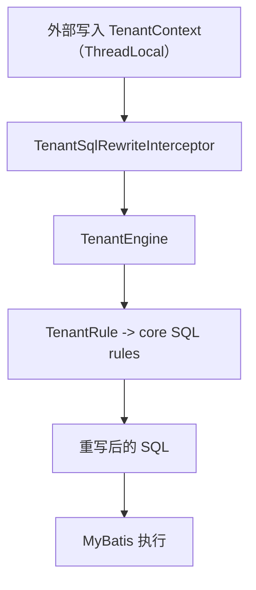

# SQL Rewriter Plugin

Plugin 模块用于把 `sql-rewriter-core` 的“规则改写能力”落到具体框架（当前是 MyBatis），并提供租户场景的默认实现。

## 当前可用插件

- 租户 MyBatis 插件：[`sql-rewriter-plugin/sql-rewriter-plugin-tenant/README.md`](./sql-rewriter-plugin-tenant/README.md)

## 工作流概览（ThreadLocal -> 重写 SQL）

如果你希望“自动把 tenantId 解析并写入 ThreadLocal”，请看 Starter：

- `sql-rewriter-starter-tenant`：[
  `sql-rewriter-starter/sql-rewriter-starter-tenant/README.md`](../sql-rewriter-starter/sql-rewriter-starter-tenant/README.md)
- `sql-rewriter-starter-tenant-feign`：[
  `sql-rewriter-starter/sql-rewriter-starter-tenant-feign/README.md`](../sql-rewriter-starter/sql-rewriter-starter-tenant-feign/README.md)

