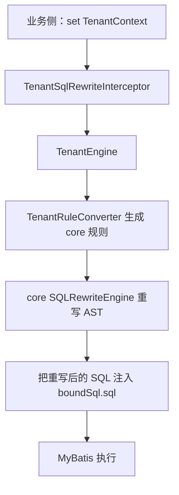

# SQL Rewriter Plugin - Tenant

租户插件提供 MyBatis 层面的 SQL 重写能力：当你的代码链路中已写入 `TenantContext`（ThreadLocal）后，MyBatis 会在执行前读取租户配置并对
SQL AST 进行改写。

## 关键类说明

- `TenantContext`：`ThreadLocal` 存储当前租户的 `TenantConfig`
- `TenantSqlRewriteInterceptor`：MyBatis 拦截器，读取 `TenantContext` 并执行重写
- `TenantEngine`：基于 `TenantConfig` 生成租户规则集合，并调用 core 引擎重写 SQL
- `TenantRule`：把 `TenantConfig` 转换为内部规则项（按优先级排序）
- `TenantRuleConverter`：`TenantConfig` -> SQL 规则（SELECT/INSERT/UPDATE/DELETE 分别生成不同规则）

## 工作流程（简图）



## 如何使用（两种方式）

### 方式一：直接用 Starter（推荐）

`sql-rewriter-starter-tenant` 会自动注册 MyBatis 拦截器，并通过 AOP 在方法/类上解析 `@TenantMapping`，最终把配置写入
`TenantContext`。

- `sql-rewriter-starter/sql-rewriter-starter-tenant/README.md`
- `sql-rewriter-starter/sql-rewriter-starter-tenant-feign/README.md`

### 方式二：不依赖 Starter，手动写入 TenantContext

你可以使用 `TenantContextHolder` 做 try-with-resources，确保链路结束后清理 ThreadLocal：

```java
String tenantId = "TENANT_001";

TenantConfig config = new TenantConfig(Arrays.asList(
        new TenantConfig.ConfigItem(
                Arrays.asList(SQLTypeEnum.SELECT),
                Arrays.asList("orders"),
                "tenant_id",
                null,            // INSERT 用的 column value supplier
                null,            // DELETE 用的 condition value supplier
                null,            // UPDATE 用的 condition value supplier
                () -> tenantId, // SELECT 用的 condition value supplier
                1                // priority
        )
));

try(
TenantContextHolder.AutoCloseableHolder ignored = TenantContextHolder.setConfig(config)){
        // 在这里执行你的 MyBatis mapper 方法
        // TenantSqlRewriteInterceptor 会读取 TenantContext 并重写 SQL
        }
```

#### 配置提醒

- `TenantConfig.ConfigItem` 里的 supplier 需要与 `rewritableSqlTypes` 对应：
    - 包含 `INSERT`：必须提供 `insertColumnValueSupplier`
    - 包含 `SELECT`：必须提供 `selectConditionColumnValueSupplier`
    - 包含 `UPDATE`：必须提供 `updateConditionColumnValueSupplier`
    - 包含 `DELETE`：必须提供 `deleteConditionColumnValueSupplier`
- `TenantSqlRewriteInterceptor` 在 `TenantContext` 为空时会直接 `proceed`，保持原 SQL 不变。

## 与 core / starter 的关系

- `sql-rewriter-core`：提供“规则改写 AST”的能力
- 本插件：把租户配置（ThreadLocal）接入 MyBatis 拦截器，把它转成 core 规则并执行
- `sql-rewriter-starter-tenant`：用注解把 “tenantId -> TenantConfig -> TenantContext -> 重写” 串起来

相关链接：

- `sql-rewriter-core`：[`sql-rewriter-core/README.md`](../../../sql-rewriter-core/README.md)
- `sql-rewriter-starter-tenant`：[
  `sql-rewriter-starter/sql-rewriter-starter-tenant/README.md`](../../../sql-rewriter-starter/sql-rewriter-starter-tenant/README.md)
- `sql-rewriter-starter-tenant-feign`：[
  `sql-rewriter-starter/sql-rewriter-starter-tenant-feign/README.md`](../../../sql-rewriter-starter/sql-rewriter-starter-tenant-feign/README.md)

