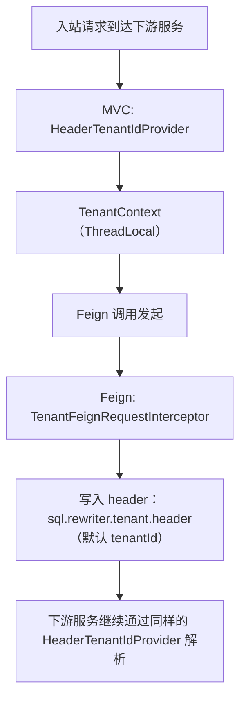

# SQL Rewriter Starter - Tenant Feign

将 `sql-rewriter-starter-tenant` 的租户能力接入：

- Spring MVC：提供 `TenantIdProvider`，从请求头读取 `tenantId`
- Feign：提供 `feign.RequestInterceptor`，把当前 `TenantContext` 的租户标识透传到下游请求头

## 使用方式

1. 在配置类上启用 Feign 透传：

```java
@Configuration
@EnableTenantSqlRewriterFeign
public class TenantFeignAutoConfig {
}
```

2. 在调用 Feign 的业务方法上声明租户映射，并指定租户 ID 提供器：

```java

@TenantMapping(
        tenantId = @TenantId(tenantIdProvider = HeaderTenantIdProvider.class),
        tenantTargets = @TenantTargets({
                @TenantTarget(tableNames = {"orders"}, columnName = "tenant_id")
        })
)
public void listOrders() {
    // 调用下游 Feign 时会带上 tenantId
}
```

3. 租户 header key 默认是 `tenantId`，也可以通过配置项 `sql.rewriter.tenant.header` 修改。

### 示例：自定义透传 header key

例如你希望使用 `X-Tenant-Id` 作为租户 header，可以在 `application.yml` 配置：

```yaml
sql:
  rewriter:
    tenant:
      header: X-Tenant-Id
```

## 透传逻辑说明

当你在业务方法上启用了 `@TenantMapping`（并能解析出 `tenantId`）后，Feign 的 `RequestInterceptor` 会在发起请求时把租户标识写入
header：

- 如果当前 `TenantContext` 为空，或者其中与 `SELECT` 相关的 tenant 配置项解析不到 `tenantId`，则不会添加 header
- `tenantId` 选择优先级：优先使用 `rewritableSqlTypes` 包含 `SELECT` 的 `ConfigItem`，取第一个非空的
  `selectConditionColumnValue`
- 若没有任何 `SELECT` 项命中或取不到值，则回退到任意 `ConfigItem` 的第一个非空 `selectConditionColumnValue`

## 启用方式提醒

- `@EnableTenantSqlRewriterFeign` 是显式入口，它通过元注解等效启用了 `@EnableTenantSqlRewriter`
- 同时会注册 Spring MVC 的 `TenantIdProvider`（从请求头读取）和 Feign 的透传拦截器

## 请求透传流程图（header）



## 相关模块

- 租户注解接入（AOP + MyBatis 重写）：[`sql-rewriter-starter-tenant`](../sql-rewriter-starter-tenant/README.md)
- MyBatis 租户插件实现（ThreadLocal -> 重写 SQL）：[
  `sql-rewriter-plugin-tenant`](../../sql-rewriter-plugin/sql-rewriter-plugin-tenant/README.md)

