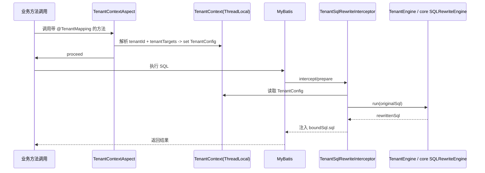

# SQL Rewriter Starter - Tenant

租户快速启动模块（注解启用）。

## 用法

1. 在 Spring `@Configuration` 上开启租户 starter：

```java

@Configuration
@EnableTenantSqlRewriter
public class TenantAutoConfig {
}
```

2. 提供一个 `TenantIdProvider` Bean：用于运行时解析当前链路租户 ID（不在注解里写死）。

```java

@Component
public class HeaderTenantIdProvider implements TenantIdProvider {
    @Override
    public Object getTenantId() {
        // 从请求头/上下文中解析 tenantId
        return "TENANT_001";
    }
}
```

3. 在方法（或类）上声明租户 ID 获取方式和目标表-字段组合：

```java

@Service
public class OrderService {

    @TenantMapping(
            tenantId = @TenantId(tenantIdProvider = HeaderTenantIdProvider.class),
            tenantTargets = @TenantTargets({
                    @TenantTarget(tableNames = {"orders"}, columnName = "tenant_id"),
                    @TenantTarget(tableNames = {"users"}, columnName = "tenant_code", priority = 5)
            })
    )
    public void listOrders() {
        // 运行时通过 HeaderTenantIdProvider 获取 tenantId，
        // 并对 orders.tenant_id / users.tenant_code 注入租户过滤条件
    }
}
```

如需使用固定租户值（不依赖 Provider），可以：

```java

@TenantMapping(
        tenantId = @TenantId(value = "TENANT_001"),
        tenantTargets = @TenantTargets({
                @TenantTarget(tableNames = {"orders"}, columnName = "tenant_id")
        })
)
public void listOrders() {
}
```

### 示例：多个 TenantTarget + 不同 SQL 类型 / priority

当一个业务需要对同一条链路改写多个表/字段时，可以在 `tenantTargets` 中配置多个 `@TenantTarget`：

```java

@TenantMapping(
        tenantId = @TenantId(tenantIdProvider = HeaderTenantIdProvider.class),
        tenantTargets = @TenantTargets({
                // SELECT：对 orders 增加 WHERE tenant_id = ?
                @TenantTarget(
                        tableNames = {"orders"},
                        columnName = "tenant_id",
                        sqlTypes = {SQLTypeEnum.SELECT},
                        priority = 1
                ),
                // UPDATE：对 orders 增加 WHERE tenant_id = ?（更高优先级也可以配置更小的 priority）
                @TenantTarget(
                        tableNames = {"orders"},
                        columnName = "tenant_id",
                        sqlTypes = {SQLTypeEnum.UPDATE},
                        priority = 1
                ),
                // INSERT：对 orders 自动注入租户字段
                @TenantTarget(
                        tableNames = {"orders"},
                        columnName = "tenant_id",
                        sqlTypes = {SQLTypeEnum.INSERT},
                        priority = 5
                )
        })
)
public void mutateOrders() {
    // 不同 sqlTypes 会控制 SQL 重写时适用的配置项
}
```

### 示例：动态 tableNames / columnName（使用 Provider）

当表名或字段名不是固定写死时，可以使用 Provider 类型（接口返回值由你实现）：

```java

@TenantMapping(
        tenantId = @TenantId(tenantIdProvider = HeaderTenantIdProvider.class),
        tenantTargets = @TenantTargets({
                @TenantTarget(
                        tableNamesProvider = TenantTableNamesProvider.class,
                        columnNameProvider = TenantColumnNameProvider.class,
                        // 当 Provider 返回 null 或异常时，最终可能导致 tenantId 解析失败，从而跳过 SQL 重写
                        sqlTypes = {SQLTypeEnum.SELECT},
                        priority = 10
                )
        })
)
public void listDynamic() {
}
```

### 示例：类级别 @TenantMapping 生效

`@TenantMapping` 也支持标在类上，此时类的所有匹配方法会共用同一套租户映射配置：

```java

@TenantMapping(
        tenantId = @TenantId(value = "TENANT_001"),
        tenantTargets = @TenantTargets({
                @TenantTarget(tableNames = {"orders"}, columnName = "tenant_id")
        })
)
public class OrderService {
    public void listOrders() {
    }
}
```

## 说明

本 starter 支持三段式控制：

- `@EnableTenantSqlRewriter`：开启能力（启动级开关）
- `@TenantMapping`：组合注解（包含 `@TenantId` + `@TenantTargets/@TenantTarget`）
- `TenantIdProvider`：Provider 接口（用于运行时解析 tenantId）

## 关键语义（务必了解）

### tenantId 为 `null` 时：跳过 SQL 重写

当 `TenantIdProvider`（或固定值）解析出来的 `tenantId` 为 `null` 时，框架会在当前调用链上**直接 `proceed`**：

- 不会写入 `TenantContext`
- 不会触发 MyBatis SQL 重写
- 若调用发生在“外层已经存在 TenantContext”的场景，会先临时清空再恢复，避免污染外层上下文

这能保证“无法确定租户”时系统不会产生错误的跨租户改写。

### Provider 解析规则

`TenantIdProvider`（以及 `TenantTableNamesProvider` / `TenantColumnNameProvider`）的解析顺序为：

1. 若 Spring 容器中存在该 `providerClass` 对应的 Bean，则优先从容器取
2. 否则尝试通过 `providerClass#getDeclaredConstructor().newInstance()` 反射创建
3. 若实例化失败或返回 `null`，则最终可能导致 `tenantId` 为 `null`，进而跳过 SQL 重写

### 注解约束（入口只建议用 TenantMapping）

- `@TenantMapping` 可以标在“方法或类”上，并作为唯一入口被切面识别
- `@TenantId` / `@TenantTargets` / `@TenantTarget` 的 `@Target` 已限制为仅能作为 `@TenantMapping` 的属性使用，不建议直接单独标在方法/类上

## 工作流程图（注解 -> TenantContext -> SQL 重写）



## 相关模块

- MyBatis 插件（ThreadLocal -> 重写 SQL）：[
  `sql-rewriter-plugin-tenant`](../../sql-rewriter-plugin/sql-rewriter-plugin-tenant/README.md)
- Feign 透传扩展（写入下游 header）：[`sql-rewriter-starter-tenant-feign`](../sql-rewriter-starter-tenant-feign/README.md)

